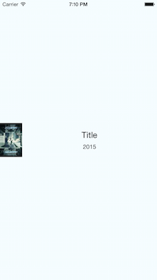
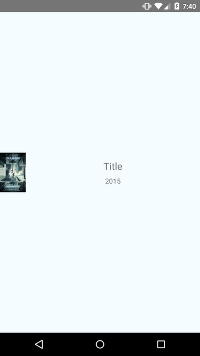
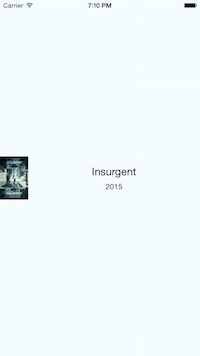
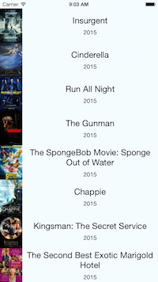
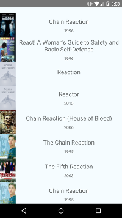

## 1.序言

本教程希望让您快速熟悉使用React Native来编写iOS和Android App的技巧。如果你希望知道React Native是什么以及为什么Facebook打造了它，可以读读[这篇博文](http://bbs.reactnative.cn/topic/14)

我们这里假设你已经有了使用React编写Web应用程序的经验。如果还没有，建议你可以先从[React官网](http://facebook.github.io/react/)开始学习。

## 2.准备工作

React Native需要一些基础的配置工作，你可以参考[开始使用React Native](/docs/getting-started.html)来进行。

在所有依赖的软件都已经安装完毕后，只需要输入两条命令就可以创建一个React Native工程。

1. `npm install -g react-native-cli`

__Taakey__：若提示权限不够的话，就执行 `sudo npm install -g react-native-cli`

react-native-cli是一个终端命令，它可以完成其余的设置工作。它可以通过npm安装。刚才这条命令会往你的终端安装一个叫做`react-native`的命令。这个安装过程你只需要进行一次。

2. `react-native init AwesomeProject`

__Taakey__

```
To run your app on iOS:
   cd /Users/imac/gitprojects/AwesomeProject
   react-native run-ios
   - or -
   Open /Users/imac/gitprojects/AwesomeProject/ios/AwesomeProject.xcodeproj in Xcode
   Hit the Run button
To run your app on Android:
   Have an Android emulator running (quickest way to get started), or a device connected
   cd /Users/imac/gitprojects/AwesomeProject
   react-native run-android
```

   这个命令会初始化一个工程、下载React Native的所有源代码和依赖包，最后在`AwesomePrjoect/iOS/AwesomeProject.xcodeproj`和`AwesomeProject/android/app`下分别创建一个新的XCode工程和一个gradle工程。  
    
__译注__：由于众所周知的网络原因，react-native命令行从npm官方源拖代码时会遇上麻烦。请先将npm仓库源替换为国内镜像：  

```bash
npm config set registry https://registry.npm.taobao.org
npm config set disturl https://npm.taobao.org/dist
```

另，执行init时切记不要在前面加上sudo（否则新项目的目录所有者会变为root而不是当前用户，导致一系列权限问题，请使用chown修复）。  
本站论坛区提供了[完整的绿色纯净新项目包](http://bbs.reactnative.cn/topic/11)。完整打包全部iOS和Android的第三方依赖，只要环境配置正确，无需科学上网漫长等待，解压即可直接运行。

## 3.开发

想开发iOS版本，你现在可以在XCode中打开刚刚创建的工程(`AwesomePrjoect/iOS/AwesomeProject.xcodeproj`)，然后只要按下`⌘+R`就可以构建并运行。这个操作会同时打开一个用于实现动态代码加载的Node服务（React Packager）。所以每当你修改代码，你只需要在模拟器中按下`⌘+R`，而无需重新在XCode中编译。

想开发Android版本，先连接你的设备或启动模拟器，然后在`AwesomeProject`目录下运行`react-native run-android`，就会构建工程并自动安装到你的模拟器或者设备，同时启动用于实现动态代码加载的Node服务。当你修改代码之后，你需要打开摇一摇菜单(摇一下设备，或者按下设备的Menu键，或者在模拟器上按下F2或Page Up，Genymotion按下⌘+M)，然后在菜单中点击“Reload JS”。

在本向导中我们会创建一个简单的Movies应用，它可以获取25个上映中的电影，然后把他们在一个ListView中显示。

### 3.1 Hello World

`react-native init`命令会创建一个指定名字的应用，我们刚才输入的命令就创建了一个名为AwesomeProject的应用。这是一个简单的Hello World应用。对于iOS版本，你可以编辑`index.ios.js`来做一些改动，然后在模拟器中按⌘+R来看到修改的结果。对Android版本，你可以编辑`index.android.js`来做一些改动，然后在摇一摇菜单中点击“Reload JS”来看到修改的结果。

### 3.2 模拟数据

__译注__：本文的示例代码改用了ES6语法，可能和其他文档写法不一致。但React Native从0.18之后，新建项目默认已经采用了ES6语法，故我们推荐不熟悉ES6与ES5区别的朋友先读读[这篇文章](http://bbs.reactnative.cn/topic/15)，另外还可以看看[阮一峰老师的书](http://es6.ruanyifeng.com/)。

在我们真正从Rotten Tomatoes(_译注：一个国外的电影社区_)抓取数据之前，我们先制造一些模拟数据来练一练手。在Facebook我们通常在JS文件的开头，紧跟着import语句之后声明一个常量，不过这不重要，你可以把它放在`index.ios.js`和`index.android.js`的任意位置：

```javascript
var MOCKED_MOVIES_DATA = [
  {title: '标题', year: '2015', posters: {thumbnail: 'http://i.imgur.com/UePbdph.jpg'}},
];
```

### 3.3 展现一个电影

我们接下来要展现一个电影，绘制它的标题、年份、以及缩略图(_译注：这个过程我们通常会叫做“渲染/render”，后面我们都会用“渲染”这个词_)。渲染缩略图需要用到Image组件，所以把Image添加到对React的import列表中。

```javascript
import React, {
  AppRegistry,
  Component,
  Image,
  StyleSheet,
  Text,
  View,
} from 'react-native';
```

然后修改一下render函数，这样我们可以把上面创建的模拟数据渲染出来。

```javascript
  render() {
    var movie = MOCKED_MOVIES_DATA[0];
    return (
      <View style={styles.container}>
        <Text>{movie.title}</Text>
        <Text>{movie.year}</Text>
        <Image source={{uri: movie.posters.thumbnail}} />
      </View>
    );
  }
```

按下`⌘+R`或者`Reload JS`，现在你应该能看到文字"Title"和"2015"，但现在Image组件没渲染任何东西，这是因为我们还没有为图片指定我们想要渲染的宽和高。这通过样式来实现。当我们修改样式的时候，我们也应该清理掉我们不再使用的样式。

```javascript
var styles = StyleSheet.create({
  container: {
    flex: 1,
    justifyContent: 'center',
    alignItems: 'center',
    backgroundColor: '#F5FCFF',
  },
  thumbnail: {
    width: 53,
    height: 81,
  },
});
```

然后把它应用到Image组件上：

```javascript
        <Image
          source={{uri: movie.posters.thumbnail}}
          style={styles.thumbnail}
        />
```

按下`⌘+R`或者`Reload JS`，现在图片应该可以被渲染出来了。

| | |
|--|--|
| ||

### 3.4 添加样式

现在我们已经成功的把我们的数据渲染出来了，下面让我们把它弄的更好看一些。我想把文字放在图片的右边，然后把标题弄的大一些，并且水平居中：

```
+---------------------------------+
|+-------++----------------------+|
||       ||        标题          ||
|| 图片  ||                      ||
||       ||        年份          ||
|+-------++----------------------+|
+---------------------------------+
```

所以我们需要增加一个container来实现一个水平布局内嵌套一个垂直布局。

```javascript
      return (
        <View style={styles.container}>
          <Image
            source={{uri: movie.posters.thumbnail}}
            style={styles.thumbnail}
          />
          <View style={styles.rightContainer}>
            <Text style={styles.title}>{movie.title}</Text>
            <Text style={styles.year}>{movie.year}</Text>
          </View>
        </View>
      );
```

和之前相比并没有太多变化，我们增加了一个container来包装文字，然后把它移到了Image的后面（因为他们最终在图片的右边）。然后我们来看看样式要怎么改：

```javascript
  container: {
    flex: 1,
    flexDirection: 'row',
    justifyContent: 'center',
    alignItems: 'center',
    backgroundColor: '#F5FCFF',
  },
```

我们用Flexbox来布局。如果你想了解更多，可以读读[这篇文章](https://css-tricks.com/snippets/css/a-guide-to-flexbox/)。

在上面的代码片段中，我们用了一句`flexDirection: 'row'`来让我们的主容器的成员从左到右横向布局，而非默认的从上到下纵向布局。

现在我们往`style`对象里增加另一个样式：

```javascript
  rightContainer: {
    flex: 1,
  },
```

这句话的作用是让`rightContainer`在父容器中占据Image之外剩下的全部空间。如果你还不是很理解的话，你可以往`rightContainer`里增加一个`backgroundColor`看一看，然后再去掉`flex:1`对比一下。你会发现去掉这一句后，容器会变成能容纳它孩子的最小大小。

给文字添加样式就简单的多了：

```javascript
  title: {
    fontSize: 20,
    marginBottom: 8,
    textAlign: 'center',
  },
  year: {
    textAlign: 'center',
  },
```

再按一次`⌘+R`或者`Reload JS`来看看最新的结果。

| | |
|--|--|
| ||

### 3.5 拉取真正的数据

从Rotten Tomatoes的API拉取数据和学习React Native并没有什么直接关系，所以你也可以直接跳过本节。

把下面的常量放到文件的最开头（通常在require下面）来创建我们请求数据所需的地址常量REQUEST_URL

```javascript
/**
 * 为了避免骚扰，我们用了一个样例数据来替代Rotten Tomatoes的API
 * 请求，这个样例数据放在React Native的Github库中。
 */
var REQUEST_URL = 'https://raw.githubusercontent.com/facebook/react-native/master/docs/MoviesExample.json';
```

首先在应用中创建一个初始的null状态，这样可以通过`this.state.movies == null`来判断我们的数据是不是已经被抓取到了。我们在服务器响应返回的时候执行`this.setState({movies: moviesData})`来改变这个状态。把下面这段代码放到我们的React类的render函数之前：

```javascript
  constructor(props) {
    super(props);   //这一句不能省略，照抄即可
    this.state = {
      movies: null,  //这里放你自己定义的state变量及初始值
    };
  }
```

组件加载完毕之后，就可以向服务器请求数据。`componentDidMount`是React组件的一个生命周期方法，它会在组件刚加载完成的时候调用一次，以后不会再被调用。React中的各种生命周期方法请[参阅此文档](http://facebook.github.io/react/docs/component-specs.html)。

```javascript
  componentDidMount() {
    this.fetchData();
  }
```

现在我们来为组件添加`fetchData`函数。你所需要做的就是在Promise调用链结束后执行`this.setState({movies:data})`。在React的工作机制下，`setState`实际上会触发一次重新渲染的流程，此时render函数被触发，发现this.state.movies不再是`null`。注意我们在Promise调用链的最后调用了`done()` —— 这样可以抛出异常而不是简单忽略。

```javascript
  fetchData() {
    fetch(REQUEST_URL)
      .then((response) => response.json())
      .then((responseData) => {
        this.setState({
          movies: responseData.movies,
        });
      })
      .done();
  }
```

现在我们来修改render函数。在电影数据加载完毕之前，先渲染一个“加载中”的视图；而如果电影数据已经加载完毕了，则渲染第一个电影数据。


```javascript
  render() {
    if (!this.state.movies) {
      return this.renderLoadingView();
    }

    var movie = this.state.movies[0];
    return this.renderMovie(movie);
  }

  renderLoadingView() {
    return (
      <View style={styles.container}>
        <Text>
          正在加载电影数据……
        </Text>
      </View>
    );
  }

  renderMovie(movie) {
    return (
      <View style={styles.container}>
        <Image
          source={{uri: movie.posters.thumbnail}}
          style={styles.thumbnail}
        />
        <View style={styles.rightContainer}>
          <Text style={styles.title}>{movie.title}</Text>
          <Text style={styles.year}>{movie.year}</Text>
        </View>
      </View>
    );
  }
```

现在再按一次`⌘+R`或者`Reload JS`，你会首先看到“正在加载电影数据……”，然后在响应数据到达之后，看到第一个电影的信息。

| | |
|--|--|
| ||

### 3.6 ListView

现在我们来让我们的应用能够渲染所有的数据而不是仅仅第一部电影。我们要用到的就是ListView组件。

为什么建议把内容放到ListView里？比起直接渲染出所有的元素，或是放到一个ScrollView里有什么优势？这是因为尽管React很高效，渲染一个可能很大的元素列表还是会很慢。`ListView`会安排视图的渲染，只显示当前在屏幕上的那些元素。而那些已经渲染好了但移动到了屏幕之外的元素，则会从原生视图结构中移除（以提高性能）。

首先要做的事情：在文件最开头，从React中引入`ListView`。

```javascript
import React, {
  AppRegistry,
  Component,
  Image,
  ListView,
  StyleSheet,
  Text,
  View,
} from 'react-native';
```

现在来修改render函数。当我们已经有了数据之后，渲染一个包含多个电影信息的ListView，而不仅仅是单个的电影。

```javascript
  render() {
    if (!this.state.loaded) {
      return this.renderLoadingView();
    }

    return (
      <ListView
        dataSource={this.state.dataSource}
        renderRow={this.renderMovie}
        style={styles.listView}
      />
    );
  }
```

`dataSource`接口用来在ListView的整个更新过程中判断哪些数据行发生了变化。

你会注意到我们现在用到了`this.state`中的`dataSource`。下一步就是在`constructor`生成的初始状态中添加一个空白的`dataSource`。另外，我们现在要把数据存储在`dataSource`中了，所以不再另外用`this.state.movies`来保存数据。我们可以在state里用一个布尔型的属性(`this.state.loaded`)来判断数据加载是否已经完成了。

```javascript
  constructor(props) {
    super(props);
    this.state = {
      dataSource: new ListView.DataSource({
        rowHasChanged: (row1, row2) => row1 !== row2,
      }),
      loaded: false,
    };
  }
```

同时我们也要修改`fetchData`方法来把数据更新到dataSource里：

```javascript
  fetchData() {
    fetch(REQUEST_URL)
      .then((response) => response.json())
      .then((responseData) => {
        this.setState({
          dataSource: this.state.dataSource.cloneWithRows(responseData.movies),
          loaded: true,
        });
      })
      .done();
  }
```

最后，我们再在`styles`对象里给`ListView`添加一些样式。

```javascript
  listView: {
    paddingTop: 20,
    backgroundColor: '#F5FCFF',
  },
```

现在可以体现最终的结果了：

| | |
|--|--|
| ||

为了实现一个完整功能的应用，接下来其实还有一些工作要做，譬如：添加导航器，搜索，加载更多，等等等等。可以在[Movies示例](https://github.com/facebook/react-native/tree/master/Examples/Movies)中看看我们做了什么。

### 3.7 最终的代码

```javascript
/**
 * Sample React Native App
 * https://github.com/facebook/react-native
 */

import React, {
  AppRegistry,
  Component,
  Image,
  ListView,
  StyleSheet,
  Text,
  View,
} from 'react-native';

var API_KEY = '7waqfqbprs7pajbz28mqf6vz';
var API_URL = 'http://api.rottentomatoes.com/api/public/v1.0/lists/movies/in_theaters.json';
var PAGE_SIZE = 25;
var PARAMS = '?apikey=' + API_KEY + '&page_limit=' + PAGE_SIZE;
var REQUEST_URL = API_URL + PARAMS;

class AwesomeProject extends Component {
  constructor(props) {
    super(props);
    this.state = {
      dataSource: new ListView.DataSource({
        rowHasChanged: (row1, row2) => row1 !== row2,
      }),
      loaded: false,
    };
  }

  componentDidMount() {
    this.fetchData();
  }

  fetchData() {
    fetch(REQUEST_URL)
      .then((response) => response.json())
      .then((responseData) => {
        this.setState({
          dataSource: this.state.dataSource.cloneWithRows(responseData.movies),
          loaded: true,
        });
      })
      .done();
  }

  render() {
    if (!this.state.loaded) {
      return this.renderLoadingView();
    }

    return (
      <ListView
        dataSource={this.state.dataSource}
        renderRow={this.renderMovie}
        style={styles.listView}
      />
    );
  }

  renderLoadingView() {
    return (
      <View style={styles.container}>
        <Text>
          Loading movies...
        </Text>
      </View>
    );
  }

  renderMovie(movie) {
    return (
      <View style={styles.container}>
        <Image
          source={{uri: movie.posters.thumbnail}}
          style={styles.thumbnail}
        />
        <View style={styles.rightContainer}>
          <Text style={styles.title}>{movie.title}</Text>
          <Text style={styles.year}>{movie.year}</Text>
        </View>
      </View>
    );
  }
};

var styles = StyleSheet.create({
  container: {
    flex: 1,
    flexDirection: 'row',
    justifyContent: 'center',
    alignItems: 'center',
    backgroundColor: '#F5FCFF',
  },
  rightContainer: {
    flex: 1,
  },
  title: {
    fontSize: 20,
    marginBottom: 8,
    textAlign: 'center',
  },
  year: {
    textAlign: 'center',
  },
  thumbnail: {
    width: 53,
    height: 81,
  },
  listView: {
    paddingTop: 20,
    backgroundColor: '#F5FCFF',
  },
});

AppRegistry.registerComponent('AwesomeProject', () => AwesomeProject);
```

## 4. 参考资料：

1. React Native是什么、为什么Facebook打造了它：
[http://bbs.reactnative.cn/topic/14](http://bbs.reactnative.cn/topic/14)

2. React官网：
[http://facebook.github.io/react/](http://facebook.github.io/react/)

3. 开始使用React Native:
[/docs/getting-started.html](/docs/getting-started.html)

4. ES6与ES5区别：
[http://bbs.reactnative.cn/topic/15](http://bbs.reactnative.cn/topic/15)

5. ES6语法介绍(阮一峰)：
[http://es6.ruanyifeng.com/](http://es6.ruanyifeng.com/)

6. flexbox布局：
[https://css-tricks.com/snippets/css/a-guide-to-flexbox/](https://css-tricks.com/snippets/css/a-guide-to-flexbox/)

7. React中的各种生命周期方法: 
[http://facebook.github.io/react/docs/component-specs.html](http://facebook.github.io/react/docs/component-specs.html)。

8. Movies示例(源自Facebook Github)：
[https://github.com/facebook/react-native/tree/master/Examples/Movies](https://github.com/facebook/react-native/tree/master/Examples/Movies)